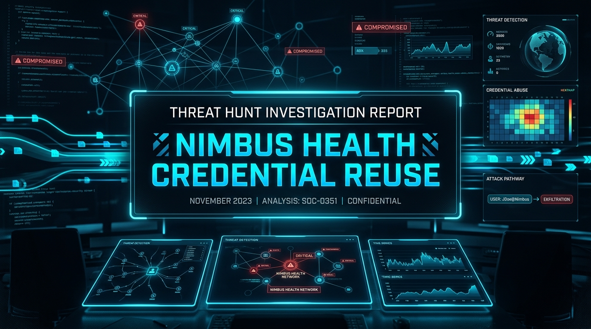

<p align="center">
  
</p>

# 🛡️ Threat Hunt Report – Nimbus Health Credential Reuse

---
## 📌 Executive Summary
This threat hunt investigated credential reuse against Nimbus Health’s Windows estate after a new starter’s public profile and breach exposure created a path from OSINT to valid corporate access. The activity did not begin as malware, ransomware, or an obvious alert. Instead, an external actor used a valid account, authenticated remotely, performed hands-on-keyboard discovery, accessed HR material outside the user’s role, staged the data locally, compressed it, and moved it out through the RDP channel they were already using.

The investigation uncovered public identity exposure, password reuse from credential-stuffing data, low-volume targeted guessing, successful RemoteInteractive logons from external sources, SMB-based access to HR data, local staging, archive creation, RDP redirected-drive exfiltration, and no evidence of operator persistence. This report documents the full attack path, supporting evidence, MITRE ATT&CK mapping, and incident response recommendations.

---
## 🎯 Hunt Objectives

* Identify the Nimbus account under review and the public exposure that made it targetable
* Determine whether exposed credentials were reused against the corporate account
* Separate low-volume targeted authentication from background internet brute-force noise
* Reconstruct the operator’s hands-on-keyboard activity in timeline order
* Determine what data was accessed outside the user’s role
* Identify staging, compression, and exfiltration through the active RDP session
* Validate whether persistence or file-server execution occurred
* Document containment and disclosure considerations

---
## 🧭 Scope & Environment

* Environment: Nimbus Health Windows Estate
* Platform: Windows estate supporting billing, HR, clinical, and IT workflows
* Host: `nh-wks-it-01.corp.nimbushealth.com`
* Account: `m.reed`
* EDR/SIEM: Microsoft Sentinel / Microsoft Defender for Endpoint
* Data Sources: DeviceLogonEvents, DeviceProcessEvents, DeviceFileEvents, DeviceEvents
* Timeframe: `2026-05-25` through `2026-05-30 UTC`

---
## 📚 Table of Contents

* [🧠 Hunt Overview](#-hunt-overview)
* [🧬 MITRE ATT&CK Summary](#-mitre-attck-summary)
* [🔍 Flag Analysis](#-flag-analysis)
* [🚨 Detection Gaps & Recommendations](#-detection-gaps--recommendations)
* [🧾 Final Assessment](#-final-assessment)
* [📎 Analyst Notes](#-analyst-notes)

---
## 🧠 Hunt Overview
The investigation began outside Sentinel. A public professional profile exposed Mason Reed’s identity, role, and personal contact address. A breach exposure lookup showed that the personal address appeared in credential-stuffing data containing passwords, making it useful for credential reuse against unrelated accounts. A cached internal support reference also exposed the public address of Nimbus Health’s remote support workstation.

Telemetry then showed that the account `m.reed` was targeted from the open internet. One source, `116.45.242.115`, stood out from background noise because it attempted only a small number of guesses against the specific account and then succeeded. The successful session was `RemoteInteractive`, confirming that the operator was not physically sitting at the workstation.

After access was established, the operator ran a short orientation burst using built-in Windows commands, then later returned from a second external source. The account enumerated a file server and an HR group, accessed HR material outside the account’s authorized IT role, staged selected files under the user profile, compressed them into an archive, and copied the archive through an RDP redirected path under `\\tsclient`.

No operator persistence was identified. Scheduled task entries on the host belonged to Group Policy and OneDrive activity. There was also no evidence that the account executed anything on the file server; HR material was reached over SMB from the workstation.

---
## 🧬 MITRE ATT&CK Summary

| Flag | Finding | Technique Category | MITRE ID | Priority |
| ---: | ------- | ------------------ | -------- | -------- |
| 1 | Account under review identified | Valid Accounts | T1078 | High |
| 2 | Public job role identified | Gather Victim Identity Information | T1589 | Medium |
| 3 | Personal email address exposed | Gather Victim Identity Information: Email Addresses | T1589.002 | Medium |
| 4 | Credential-stuffing breach identified | Credentials from Password Stores / Valid Accounts | T1555 / T1078 | High |
| 5 | Public remote support endpoint exposed | Gather Victim Network Information | T1590 | High |
| 6 | Targeted guessing source identified | Brute Force: Password Guessing | T1110.001 | High |
| 7 | RemoteInteractive access confirmed | Remote Services: RDP | T1021.001 | High |
| 8 | Second external source identified | Remote Services: RDP | T1021.001 | High |
| 9 | Initial command burst reconstructed | System Owner/User Discovery | T1033 | Medium |
| 10 | Deletion event attributed to OneDrive cleanup | System Services / Benign System Activity | N/A | Low |
| 11 | File server shares enumerated | Network Share Discovery | T1135 | Medium |
| 12 | HR group enumerated | Account Discovery: Domain Account | T1087.002 | High |
| 13 | HR file accessed outside role | Data from Network Shared Drive | T1039 | High |
| 14 | Local staging folder identified | Data Staged: Local Data Staging | T1074.001 | High |
| 15 | Archive created | Archive Collected Data | T1560 | High |
| 16 | Archive copied through RDP redirected path | Exfiltration Over Alternative Protocol / RDP | T1048 / T1021.001 | Critical |
| 17 | No operator persistence found | Persistence Review | N/A | Medium |
| 18 | No file server execution found | Lateral Movement Review | N/A | Medium |
| 19 | External credential reuse assessed | Valid Accounts | T1078 | High |
| 20 | Low-volume targeted guessing pattern confirmed | Brute Force: Password Guessing | T1110.001 | High |
| 21 | Session switch identified | Remote Services: RDP | T1021.001 | Medium |
| 22 | RDP channel checked before exfiltration | Network Share Discovery | T1135 | High |

---
## 🔍 Flag Analysis

*All flags below are collapsible for readability.*

---

<details>
<summary id="-flag-1">🚩 <strong>Flag 1: The Account Under Review</strong></summary>

### 🎯 Objective

Identify the Nimbus account that was the subject of the review.

### 📌 Finding

The account under review was:

`m.reed`

### 🔍 Evidence

| Field | Value |
| ----- | ----- |
| Employee | Mason Reed |
| AccountName | m.reed |
| Host | nh-wks-it-01.corp.nimbushealth.com |
| Evidence Source | DeviceLogonEvents |

### 💡 Why it matters

Identifying the exact account name from logs prevented confusion between the employee’s full name, public identity, and the actual corporate username used in telemetry.

### 🔧 KQL Query Used

```kql
DeviceLogonEvents
| where DeviceName == "nh-wks-it-01.corp.nimbushealth.com"
| summarize Count=count() by AccountName, ActionType, LogonType
| order by Count desc
```

### 🖼️ Screenshot

<p align="center">
  
</p>

### 🛠️ Detection Recommendation

Maintain account-to-employee mapping and correlate newly created or recently onboarded accounts with remote access attempts.

</details>

---

<details>
<summary id="-flag-2">🚩 <strong>Flag 2: Public Professional Profile</strong></summary>

### 🎯 Objective

Identify the job title Mason Reed publicly listed.

### 📌 Finding

Mason Reed listed his job title as:

`IT Support Technician`

### 🔍 Evidence

| Field | Value |
| ----- | ----- |
| Person | Mason Reed |
| Public Role | IT Support Technician |
| Evidence Source | Public professional profile |

### 💡 Why it matters

The public role helped explain why an attacker would target this account. An IT support technician could plausibly have access to support systems, shared workstations, and internal support documentation.

### 🔧 KQL Query Used

```text
No Sentinel query used. This answer came from the open-source artefact.
```

### 🖼️ Screenshot

<p align="center">
  
</p>

### 🛠️ Detection Recommendation

Review public employee profiles for exposed roles, contact information, and operational details that could support targeted credential attacks.

</details>

---

<details>
<summary id="-flag-3">🚩 <strong>Flag 3: Public Contact Address</strong></summary>

### 🎯 Objective

Identify the non-work contact address listed on Mason Reed’s public profile.

### 📌 Finding

The exposed personal email address was:

`mason.reed@hotmail.com`

### 🔍 Evidence

| Field | Value |
| ----- | ----- |
| Person | Mason Reed |
| Personal Email | mason.reed@hotmail.com |
| Evidence Source | Public professional profile |

### 💡 Why it matters

The personal email address gave the attacker a pivot into breach-exposure data and helped connect the public identity to reusable credentials.

### 🔧 KQL Query Used

```text
No Sentinel query used. This answer came from the open-source artefact.
```

### 🖼️ Screenshot

<p align="center">
  
</p>

### 🛠️ Detection Recommendation

Educate employees on limiting public exposure of personal contact information tied to professional profiles.

</details>

---

<details>
<summary id="-flag-4">🚩 <strong>Flag 4: Credential Reuse Exposure</strong></summary>

### 🎯 Objective

Determine which breach explained usable credential reuse.

### 📌 Finding

The useful breach exposure was:

`Synthient Credential Stuffing Threat Data - contains passwords from credential-stuffing lists, usable for password reuse`

### 🔍 Evidence

| Field | Value |
| ----- | ----- |
| Email | mason.reed@hotmail.com |
| Breach | Synthient Credential Stuffing Threat Data |
| Useful Data | Email addresses and passwords |
| Risk | Reused password against corporate account |

### 💡 Why it matters

The breach data contained passwords from credential-stuffing lists. That made it useful for attempting access to unrelated services where the same user reused a password.

### 🔧 KQL Query Used

```text
No Sentinel query used. This answer came from the breach exposure artefact.
```

### 🖼️ Screenshot

<p align="center">
  
</p>

### 🛠️ Detection Recommendation

Monitor for employee personal email exposure in credential-stuffing datasets and prioritize password resets plus MFA enforcement for matching corporate accounts.

</details>

---

<details>
<summary id="-flag-5">🚩 <strong>Flag 5: Remote Support Endpoint</strong></summary>

### 🎯 Objective

Identify the public address attackers could target for remote support access.

### 📌 Finding

The public remote support address was:

`135.237.163.62`

### 🔍 Evidence

| Field | Value |
| ----- | ----- |
| System | NH-WKS-IT-01 |
| Purpose | IT administration and support workstation |
| Public Address | 135.237.163.62 |
| Internal Address | 10.1.0.233 |

### 💡 Why it matters

The cached support reference exposed an internet-reachable support workstation, giving an attacker both the account target and the remote access target.

### 🔧 KQL Query Used

```text
No Sentinel query used. This answer came from the cached support reference.
```

### 🖼️ Screenshot

<p align="center">
  
</p>

### 🛠️ Detection Recommendation

Audit public document caches for exposed internal support references, hostnames, IP addresses, and remote access instructions.

</details>

---

<details>
<summary id="-flag-6">🚩 <strong>Flag 6: Targeted Guessing Source</strong></summary>

### 🎯 Objective

Identify the source IP that performed low-volume guesses against `m.reed` and eventually succeeded.

### 📌 Finding

The targeted guessing source was:

`116.45.242.115`

### 🔍 Evidence

| Field | Value |
| ----- | ----- |
| Account | m.reed |
| RemoteIP | 116.45.242.115 |
| Failures | 3 |
| Successes | 2 |
| Evidence Source | DeviceLogonEvents |

### 💡 Why it matters

This pattern separated the real intrusion from broad internet noise. The source did not spray many accounts; it made a handful of attempts against one specific account and then succeeded.

### 🔧 KQL Query Used

```kql
DeviceLogonEvents
| where DeviceName == "nh-wks-it-01.corp.nimbushealth.com"
| where AccountName == "m.reed"
| summarize 
    FirstSeen=min(Timestamp),
    LastSeen=max(Timestamp),
    Total=count(),
    Failures=countif(ActionType has "Failed" or ActionType has "LogonFailed"),
    Successes=countif(ActionType has "Success" or ActionType has "LogonSuccess")
    by RemoteIP, LogonType
| order by Successes desc, Total asc
```

### 🖼️ Screenshot

<p align="center">
  
</p>

### 🛠️ Detection Recommendation

Alert on low-volume failed logons followed by success against the same account from the same external source.

</details>

---

<details>
<summary id="-flag-7">🚩 <strong>Flag 7: Remote Logon Type</strong></summary>

### 🎯 Objective

Identify the successful logon type showing the operator was not sitting at the desk.

### 📌 Finding

The successful logon type was:

`RemoteInteractive`

### 🔍 Evidence

| Field | Value |
| ----- | ----- |
| Account | m.reed |
| Logon Type | RemoteInteractive |
| RemoteIP | 116.45.242.115 |
| Evidence Source | DeviceLogonEvents |

### 💡 Why it matters

The RemoteInteractive logon showed that this was a remote session, not activity from someone physically using the workstation.

### 🔧 KQL Query Used

```kql
DeviceLogonEvents
| where DeviceName == "nh-wks-it-01.corp.nimbushealth.com"
| where AccountName == "m.reed"
| where RemoteIP == "116.45.242.115"
| where ActionType == "LogonSuccess"
| project Timestamp, AccountName, ActionType, LogonType, RemoteIP
| order by Timestamp asc
```

### 🖼️ Screenshot

<p align="center">
  
</p>

### 🛠️ Detection Recommendation

Monitor RemoteInteractive logons from external IPs, especially for newly onboarded users or accounts without expected remote access patterns.

</details>

---

<details>
<summary id="-flag-8">🚩 <strong>Flag 8: Second External Source</strong></summary>

### 🎯 Objective

Identify the second external source used by the same account.

### 📌 Finding

The second external source was:

`45.131.194.61`

### 🔍 Evidence

| Field | Value |
| ----- | ----- |
| Account | m.reed |
| First External Source | 116.45.242.115 |
| Second External Source | 45.131.194.61 |
| Evidence Source | DeviceLogonEvents |

### 💡 Why it matters

The source change showed that the operator did not remain on one address. This supported external actor activity rather than a simple local user mistake.

### 🔧 KQL Query Used

```kql
DeviceLogonEvents
| where DeviceName == "nh-wks-it-01.corp.nimbushealth.com"
| where AccountName == "m.reed"
| where ActionType == "LogonSuccess"
| where isnotempty(RemoteIP)
| project Timestamp, AccountName, ActionType, LogonType, RemoteIP
| order by Timestamp asc
```

### 🖼️ Screenshot

<p align="center">
  
</p>

### 🛠️ Detection Recommendation

Baseline external remote access sources and alert when a single account changes external IPs during a short hands-on-keyboard window.

</details>

---

<details>
<summary id="-flag-9">🚩 <strong>Flag 9: First Command Burst</strong></summary>

### 🎯 Objective

Reconstruct the first built-in command burst after the operator began hands-on-keyboard activity.

### 📌 Finding

The first real operator command burst was:

`whoami, hostname, ipconfig /all, whoami /groups`

### 🔍 Evidence

| Field | Value |
| ----- | ----- |
| Account | m.reed |
| Host | nh-wks-it-01.corp.nimbushealth.com |
| Commands | `whoami`, `hostname`, `ipconfig /all`, `whoami /groups` |
| Evidence Source | DeviceProcessEvents |

### 💡 Why it matters

These commands showed the operator orienting themselves on the host, identifying the user context, hostname, network configuration, and group memberships.

### 🔧 KQL Query Used

```kql
DeviceProcessEvents
| where Timestamp between (datetime(2026-05-29T01:30:00Z) .. datetime(2026-05-29T01:32:00Z))
| where DeviceName == "nh-wks-it-01.corp.nimbushealth.com"
| where AccountName == "m.reed"
| where ProcessCommandLine in ("whoami", "hostname", "ipconfig /all", "whoami /groups")
| project Timestamp, FileName, ProcessCommandLine, InitiatingProcessFileName
| order by Timestamp asc
```

### 🖼️ Screenshot

<p align="center">
  
</p>

### 🛠️ Detection Recommendation

Alert on reconnaissance command chains such as `whoami`, `hostname`, `ipconfig /all`, and `whoami /groups` following unusual remote logons.

</details>

---

<details>
<summary id="-flag-10">🚩 <strong>Flag 10: Benign Deletion During First-Run Activity</strong></summary>

### 🎯 Objective

Determine whether a file deletion during the command window was actor-driven or machine-driven.

### 📌 Finding

The deletion was:

`Not the actor - OneDrive cleanup by Explorer`

### 🔍 Evidence

| Field | Value |
| ----- | ----- |
| Deleted File | OneDriveSetup.exe |
| Path | `C:\Users\m.reed\AppData\Local\Microsoft\OneDrive\...` |
| Initiating Process | Explorer.EXE |
| Assessment | Benign OneDrive cleanup |

### 💡 Why it matters

Not every deletion is anti-forensics. This deletion was tied to OneDrive first-run/update behavior, not operator cleanup.

### 🔧 KQL Query Used

```kql
DeviceProcessEvents
| where DeviceName == "nh-wks-it-01.corp.nimbushealth.com"
| where AccountName == "m.reed"
| where Timestamp between (datetime(2026-05-29T01:30:00Z) .. datetime(2026-05-29T01:42:00Z))
| where ProcessCommandLine has "del"
| project Timestamp, FileName, ProcessCommandLine, InitiatingProcessFileName, InitiatingProcessCommandLine
| order by Timestamp asc
```

### 🖼️ Screenshot

<p align="center">
  
</p>

### 🛠️ Detection Recommendation

Correlate deletion events with parent process and known application update paths before classifying them as anti-forensics.

</details>

---

<details>
<summary id="-flag-11">🚩 <strong>Flag 11: File Server Share Enumeration</strong></summary>

### 🎯 Objective

Identify the command that asked the file server what it was sharing.

### 📌 Finding

The command was:

`net view \\NH-FS-01`

### 🔍 Evidence

| Field | Value |
| ----- | ----- |
| Account | m.reed |
| Command | `net view \\NH-FS-01` |
| Target | NH-FS-01 |
| Evidence Source | DeviceProcessEvents |

### 💡 Why it matters

This command showed the operator moving beyond local discovery and enumerating network shares on a specific file server.

### 🔧 KQL Query Used

```kql
DeviceProcessEvents
| where Timestamp between (datetime(2026-05-29T01:40:00Z) .. datetime(2026-05-29T01:47:00Z))
| where DeviceName == "nh-wks-it-01.corp.nimbushealth.com"
| where AccountName == "m.reed"
| where FileName =~ "net.exe"
| where ProcessCommandLine has "NH-FS-01"
| project Timestamp, FileName, ProcessCommandLine, InitiatingProcessFileName, InitiatingProcessCommandLine
| order by Timestamp asc
```

### 🖼️ Screenshot

<p align="center">
  
</p>

### 🛠️ Detection Recommendation

Alert when non-administrative or newly onboarded accounts enumerate file server shares using `net view`.

</details>

---

<details>
<summary id="-flag-12">🚩 <strong>Flag 12: HR Group Enumeration</strong></summary>

### 🎯 Objective

Identify the command used to enumerate HR group membership.

### 📌 Finding

The command was:

`net group "NH-HR-Users" /domain`

### 🔍 Evidence

| Field | Value |
| ----- | ----- |
| Account | m.reed |
| Command | `net group "NH-HR-Users" /domain` |
| Group | NH-HR-Users |
| Evidence Source | DeviceProcessEvents |

### 💡 Why it matters

The account belonged to IT support, but it enumerated HR group membership. This was outside the expected role and helped frame the later access to HR data.

### 🔧 KQL Query Used

```kql
DeviceProcessEvents
| where DeviceName == "nh-wks-it-01.corp.nimbushealth.com"
| where AccountName == "m.reed"
| where ProcessCommandLine has "NH-HR-Users"
| project Timestamp, FileName, ProcessCommandLine
| order by Timestamp asc
```

### 🖼️ Screenshot

<p align="center">
  
</p>

### 🛠️ Detection Recommendation

Alert when accounts outside HR or identity administration enumerate HR domain groups.

</details>

---

<details>
<summary id="-flag-13">🚩 <strong>Flag 13: HR Data Access Outside Role</strong></summary>

### 🎯 Objective

Identify the HR file accessed outside the account’s expected IT role.

### 📌 Finding

The file was:

`access_request_queue_20260526.csv`

### 🔍 Evidence

| Field | Value |
| ----- | ----- |
| Account | m.reed |
| Department Path | HR |
| File | access_request_queue_20260526.csv |
| Access Method | Network share |

### 💡 Why it matters

The role matrix gave this account IT share access, not HR access. Opening this HR file crossed the role boundary and established unauthorized data access.

### 🔧 KQL Query Used

```kql
DeviceProcessEvents
| where DeviceName == "nh-wks-it-01.corp.nimbushealth.com"
| where AccountName == "m.reed"
| where ProcessCommandLine has_any ("NH-FS-01", "HR", "AccessRequests")
| project Timestamp, FileName, ProcessCommandLine
| order by Timestamp asc
```

### 🖼️ Screenshot

<p align="center">
  
</p>

### 🛠️ Detection Recommendation

Monitor cross-department file share access, especially when accounts access shares outside their documented role matrix.

</details>

---

<details>
<summary id="-flag-14">🚩 <strong>Flag 14: Local Staging Folder</strong></summary>

### 🎯 Objective

Identify the local folder where material was staged before exfiltration.

### 📌 Finding

The staging folder was:

`C:\Users\m.reed\Documents\SupportReview`

### 🔍 Evidence

| Field | Value |
| ----- | ----- |
| Account | m.reed |
| Staging Folder | `C:\Users\m.reed\Documents\SupportReview` |
| Staged Files | HR and support review files |
| Evidence Source | DeviceFileEvents |

### 💡 Why it matters

Local staging showed that the operator collected selected files before compressing and moving them out through the RDP session.

### 🔧 KQL Query Used

```kql
DeviceFileEvents
| where DeviceName == "nh-wks-it-01.corp.nimbushealth.com"
| where InitiatingProcessAccountName == "m.reed"
| where Timestamp between (datetime(2026-05-29T01:50:00Z) .. datetime(2026-05-29T01:56:30Z))
| where FolderPath startswith @"C:\Users\m.reed\Documents"
| project Timestamp, ActionType, FileName, FolderPath, InitiatingProcessFileName, InitiatingProcessCommandLine
| order by Timestamp asc
```

### 🖼️ Screenshot

<p align="center">
  
</p>

### 🛠️ Detection Recommendation

Alert on newly created staging folders under user profile paths that receive files from sensitive network shares.

</details>

---

<details>
<summary id="-flag-15">🚩 <strong>Flag 15: Archive Creation</strong></summary>

### 🎯 Objective

Identify the compressed archive created from staged material.

### 📌 Finding

The archive was:

`support_review_202605.zip`

### 🔍 Evidence

| Field | Value |
| ----- | ----- |
| Account | m.reed |
| Archive | support_review_202605.zip |
| Archive Path | `C:\Users\m.reed\Documents\support_review_202605.zip` |
| Evidence Source | DeviceFileEvents |

### 💡 Why it matters

Archive creation showed that the operator consolidated staged material into a single file before moving it out.

### 🔧 KQL Query Used

```kql
DeviceFileEvents
| where DeviceName == "nh-wks-it-01.corp.nimbushealth.com"
| where InitiatingProcessAccountName == "m.reed"
| where FileName == "support_review_202605.zip"
| project Timestamp, ActionType, FileName, FolderPath, InitiatingProcessFileName
| order by Timestamp asc
```

### 🖼️ Screenshot

<p align="center">
  
</p>

### 🛠️ Detection Recommendation

Alert on archive creation shortly after sensitive share access or cross-department file access.

</details>

---

<details>
<summary id="-flag-16">🚩 <strong>Flag 16: RDP Redirected-Drive Exfiltration</strong></summary>

### 🎯 Objective

Identify the destination path where the archive was written through the RDP channel.

### 📌 Finding

The archive was written to:

`\\tsclient\G\Temp\NimbusSupport`

### 🔍 Evidence

| Field | Value |
| ----- | ----- |
| Archive | support_review_202605.zip |
| Local Source | `C:\Users\m.reed\Documents\support_review_202605.zip` |
| Destination Path | `\\tsclient\G\Temp\NimbusSupport` |
| Exfil Channel | RDP redirected client drive |

### 💡 Why it matters

The data did not leave through a normal web upload or obvious network exfiltration path. It left through the existing RDP session using client-drive redirection.

### 🔧 KQL Query Used

```kql
DeviceFileEvents
| where DeviceName == "nh-wks-it-01.corp.nimbushealth.com"
| where InitiatingProcessAccountName == "m.reed"
| where Timestamp between (datetime(2026-05-29T01:50:00Z) .. datetime(2026-05-29T02:15:00Z))
| where FolderPath has_any ("tsclient", "support_review_202605.zip")
| project Timestamp, ActionType, FileName, FolderPath, InitiatingProcessFileName, InitiatingProcessCommandLine
| order by Timestamp asc
```

### 🖼️ Screenshot

<p align="center">
  
</p>

### 🛠️ Detection Recommendation

Monitor writes to `\\tsclient\` paths during RDP sessions, especially when the file is an archive or follows sensitive file access.

</details>

---

<details>
<summary id="-flag-17">🚩 <strong>Flag 17: Persistence Review</strong></summary>

### 🎯 Objective

Determine whether the operator established persistence and account for scheduled task entries.

### 📌 Finding

The assessment was:

`No operator persistence - Group Policy and OneDrive scheduled tasks`

### 🔍 Evidence

| Field | Value |
| ----- | ----- |
| Operator Persistence | No |
| Entries Found | Group Policy and OneDrive scheduled tasks |
| Subject Users | NH-WKS-IT-01$, m.reed |
| Evidence Source | DeviceEvents |

### 💡 Why it matters

This prevented overstatement. Scheduled task entries existed, but they were explainable as normal Group Policy and OneDrive activity, not attacker-created persistence.

### 🔧 KQL Query Used

```kql
DeviceEvents
| where DeviceName == "nh-wks-it-01.corp.nimbushealth.com"
| where Timestamp between (datetime(2026-05-25T00:00:00Z) .. datetime(2026-05-30T23:59:59Z))
| where ActionType in ("ScheduledTaskCreated", "ScheduledTaskDeleted")
| project Timestamp, ActionType, AccountName, InitiatingProcessFileName, InitiatingProcessCommandLine, AdditionalFields
| order by Timestamp asc
```

### 🖼️ Screenshot

<p align="center">
  
</p>

### 🛠️ Detection Recommendation

Differentiate legitimate scheduled task churn from attacker persistence by checking task names, subject users, commands, and parent processes.

</details>

---

<details>
<summary id="-flag-18">🚩 <strong>Flag 18: File Server Execution Review</strong></summary>

### 🎯 Objective

Determine whether the account executed anything on the file server.

### 📌 Finding

The assessment was:

`No - accessed via SMB share`

### 🔍 Evidence

| Field | Value |
| ----- | ----- |
| File Server Execution | No |
| Execution Host Seen | nh-wks-it-01.corp.nimbushealth.com |
| Access Method | SMB share |
| Remote Path Pattern | `\\NH-FS-01\HR\...` |

### 💡 Why it matters

The operator accessed HR files, but there was no evidence of process execution on the file server. This supported a workstation-only compromise with network share access.

### 🔧 KQL Query Used

```kql
DeviceProcessEvents
| where Timestamp between (datetime(2026-05-25T00:00:00Z) .. datetime(2026-05-30T23:59:59Z))
| where AccountName == "m.reed"
| summarize Count=count() by DeviceName
| order by Count desc
```

### 🖼️ Screenshot

<p align="center">
  
</p>

### 🛠️ Detection Recommendation

When sensitive file access is identified, validate whether the account executed on the file server or accessed files remotely through SMB.

</details>

---

<details>
<summary id="-flag-19">🚩 <strong>Flag 19: Honest Incident Assessment</strong></summary>

### 🎯 Objective

Provide the honest read of what happened and what evidence ruled out alternatives.

### 📌 Finding

The assessment was:

`External credential reuse by a remote actor from 116.45.242.115/45.131.194.61 - no malware/persistence and no local console activity`

### 🔍 Evidence

| Field | Value |
| ----- | ----- |
| Account | m.reed |
| Actor Type | External remote actor |
| Source IPs | 116.45.242.115, 45.131.194.61 |
| Malware Evidence | Not observed |
| Persistence Evidence | Not observed |
| Local Console Activity | Not observed |

### 💡 Why it matters

This was not simply a curious new starter, and it was not malware-driven. The evidence supported external credential reuse through remote interactive access.

### 🔧 KQL Query Used

```kql
DeviceLogonEvents
| where DeviceName == "nh-wks-it-01.corp.nimbushealth.com"
| where AccountName == "m.reed"
| where ActionType == "LogonSuccess"
| project Timestamp, AccountName, LogonType, RemoteIP
| order by Timestamp asc
```

### 🖼️ Screenshot

<p align="center">
  
</p>

### 🛠️ Detection Recommendation

Document whether an incident is credential misuse, malware, or insider activity by tying the conclusion to logon type, source IP, persistence evidence, and process execution scope.

</details>

---

<details>
<summary id="-flag-20">🚩 <strong>Flag 20: Credential Reuse Pattern</strong></summary>

### 🎯 Objective

Prove the activity was credential reuse, not broad brute force.

### 📌 Finding

The pattern was:

`3 failures then success - low-volume targeted attempts against m.reed match exposed credential-stuffing data, not brute force`

### 🔍 Evidence

| Field | Value |
| ----- | ----- |
| Account | m.reed |
| Source IP | 116.45.242.115 |
| Failed Attempts | 3 |
| Result | Successful logon |
| Explanation | Exposed password reuse |

### 💡 Why it matters

The small number of failures followed by success matched a targeted credential-reuse attempt, not high-volume guessing.

### 🔧 KQL Query Used

```kql
DeviceLogonEvents
| where DeviceName == "nh-wks-it-01.corp.nimbushealth.com"
| where AccountName == "m.reed"
| summarize 
    Failures=countif(ActionType has "Failed" or ActionType has "LogonFailed"),
    Successes=countif(ActionType has "Success" or ActionType has "LogonSuccess")
    by RemoteIP
| order by Successes desc
```

### 🖼️ Screenshot

<p align="center">
  
</p>

### 🛠️ Detection Recommendation

Create detections for low-volume failed attempts followed by success where the account has known breach exposure.

</details>

---

<details>
<summary id="-flag-21">🚩 <strong>Flag 21: Session Switch</strong></summary>

### 🎯 Objective

Explain the gap between the first command burst and the later activity.

### 📌 Finding

The session changed as follows:

`New session started, then RemoteIP changed to 45.131.194.61 at 5/29/2026, 1:40:01.537 AM`

### 🔍 Evidence

| Field | Value |
| ----- | ----- |
| First Session LogonId | 1174032 |
| Second Session LogonId | 3790387 |
| First Source | 116.45.242.115 |
| Second Source | 45.131.194.61 |
| Second Session Start | 5/29/2026, 1:40:01.537 AM |

### 💡 Why it matters

The gap was not inactivity from the same session. The operator left and returned under a new session, then continued activity from a different external source.

### 🔧 KQL Query Used

```kql
DeviceLogonEvents
| where DeviceName == "nh-wks-it-01.corp.nimbushealth.com"
| where AccountName == "m.reed"
| where Timestamp between (datetime(2026-05-29T01:25:00Z) .. datetime(2026-05-29T01:45:00Z))
| where ActionType == "LogonSuccess"
| project Timestamp, LogonType, RemoteIP, RemoteDeviceName, AccountName, LogonId, ReportId
| order by Timestamp asc
```

### 🖼️ Screenshot

<p align="center">
  
</p>

### 🛠️ Detection Recommendation

Correlate command bursts with LogonId and RemoteIP changes to identify session switches during hands-on-keyboard activity.

</details>

---

<details>
<summary id="-flag-22">🚩 <strong>Flag 22: RDP Channel Check</strong></summary>

### 🎯 Objective

Identify the command that checked the RDP redirected channel before the archive left.

### 📌 Finding

The command was:

`net view \\tsclient`

### 🔍 Evidence

| Field | Value |
| ----- | ----- |
| Account | m.reed |
| Command | `net view \\tsclient` |
| Channel | RDP redirected client shares |
| Later Destination | `\\tsclient\G\Temp\NimbusSupport` |

### 💡 Why it matters

This command separated premeditated exfiltration from an accidental copy. The operator checked the redirected RDP channel before writing the archive to it.

### 🔧 KQL Query Used

```kql
DeviceProcessEvents
| where DeviceName == "nh-wks-it-01.corp.nimbushealth.com"
| where AccountName == "m.reed"
| where ProcessCommandLine has @"\\tsclient"
| project Timestamp, FileName, ProcessCommandLine
| order by Timestamp asc
```

### 🖼️ Screenshot

<p align="center">
  
</p>

### 🛠️ Detection Recommendation

Alert on `net view \\tsclient` followed by file writes to `\\tsclient\` paths in RDP sessions.

</details>

---

## 🚨 Detection Gaps & Recommendations

| Area | Gap Identified | Recommendation |
| ---- | -------------- | -------------- |
| Credential Exposure | Personal email breach exposure created a path to corporate access | Monitor exposed employee credentials and force password resets when personal accounts appear in credential-stuffing data |
| Remote Access | Internet-facing support workstation accepted RemoteInteractive logons | Restrict RDP exposure, require VPN or ZTNA, and enforce MFA |
| Authentication | Low-volume targeted guessing blended into internet noise | Detect failed attempts followed by success against one account from one source |
| Session Monitoring | External IP changed during the same incident window | Alert on short-window RemoteInteractive source changes for the same account |
| Reconnaissance | Built-in discovery commands ran after remote access | Detect chained commands like `whoami`, `hostname`, `ipconfig /all`, and `whoami /groups` |
| Share Discovery | File server and HR group enumeration occurred from an IT support account | Monitor `net view` and `net group` activity for users outside administrative roles |
| Data Access | HR data was accessible to an account outside its role | Enforce least privilege and review cross-department share permissions |
| Staging | Sensitive files were staged under the user profile | Alert on multiple sensitive files copied into new local folders |
| Exfiltration | Archive was copied through `\\tsclient` instead of a web upload | Monitor RDP redirected-drive writes, especially archive files |
| Persistence Review | Benign scheduled task activity could be misread | Enrich scheduled task alerts with task name, subject user, and command path |

---
## 🧾 Final Assessment

The honest read is that Nimbus Health experienced external credential reuse against the `m.reed` account. The account belonged to a new IT Support Technician whose public profile exposed a personal email address. That email appeared in credential-stuffing breach data containing passwords, and the attacker used that exposure to perform a small number of targeted guesses before successfully authenticating.

Once connected through RDP, the operator performed basic host and account discovery, enumerated the file server and HR group, accessed HR data outside the account’s role, staged selected files locally, compressed them into `support_review_202605.zip`, and exfiltrated the archive through the existing RDP redirected client path `\\tsclient\G\Temp\NimbusSupport`.

No operator persistence was identified. The scheduled tasks found during the investigation belonged to normal Group Policy and OneDrive activity. There was also no evidence that the account executed anything on the file server; the HR files were accessed over SMB from the workstation.

The first containment action should be to disable the account and terminate active RDP sessions. A password reset alone is not enough because it does not close an already active remote session. Because employee HR personal data was exfiltrated, the incident also triggers privacy and breach notification review.

---
## 📎 Analyst Notes

* The loudest authentication noise was not the story. The real signal was a low-volume source that targeted `m.reed` and succeeded.
* The first command burst did not begin when the session opened. Windows and Edge first-run activity occurred before the first real operator commands.
* The deletion event during the session was not anti-forensics. It was OneDrive cleanup initiated by Explorer.
* HR data access did not require execution on the file server. The operator reached the material over SMB from the compromised workstation.
* Exfiltration occurred through RDP client-drive redirection rather than a normal upload path.
* The root cause was exposed/reused credentials combined with reachable remote support access and insufficient access control around HR data.

---
## ✅ Confirmed Answers

| Question | Answer |
|---|---|
| Q00 - Setup Gate | `Nimbus support review ready` |
| Q01 - The Account Under Review | `m.reed` |
| Q02 - Public Profile Job Title | `IT Support Technician` |
| Q03 - Contact Address | `mason.reed@hotmail.com` |
| Q04 - Which Breach Explains the Reuse | `Synthient Credential Stuffing Threat Data - contains passwords from credential-stuffing lists, usable for password reuse` |
| Q05 - The Remote Support Endpoint | `135.237.163.62` |
| Q06 - The Guessing Source | `116.45.242.115` |
| Q07 - Successful Logon Type | `RemoteInteractive` |
| Q08 - Second External Source | `45.131.194.61` |
| Q09 - Getting Their Bearings | `whoami, hostname, ipconfig /all, whoami /groups` |
| Q10 - File Deletion in the Burst | `Not the actor - OneDrive cleanup by Explorer` |
| Q11 - Looking at the File Server | `net view \\NH-FS-01` |
| Q12 - Who Is In HR | `net group "NH-HR-Users" /domain` |
| Q13 - Crossing the Line | `access_request_queue_20260526.csv` |
| Q14 - Where They Put It | `C:\Users\m.reed\Documents\SupportReview` |
| Q15 - The Archive | `support_review_202605.zip` |
| Q16 - How It Left | `\\tsclient\G\Temp\NimbusSupport` |
| Q17 - What They Left Behind | `No operator persistence - Group Policy and OneDrive scheduled tasks` |
| Q18 - Where They Actually Sat | `No - accessed via SMB share` |
| Q19 - The Honest Read | `External credential reuse by a remote actor from 116.45.242.115/45.131.194.61 - no malware/persistence and no local console activity` |
| Q20 - The Guessing Pattern | `3 failures then success - low-volume targeted attempts against m.reed match exposed credential-stuffing data, not brute force` |
| Q21 - The Session Switch | `New session started, then RemoteIP changed to 45.131.194.61 at 5/29/2026, 1:40:01.537 AM` |
| Q22 - The Channel Check | `net view \\tsclient` |
| IR1 - First Containment | `Disable the account and terminate active RDP sessions - password reset does not close an already open remote session` |
| IR2 - The Disclosure Question | `Employee HR personal data - triggers privacy/breach notification review` |
